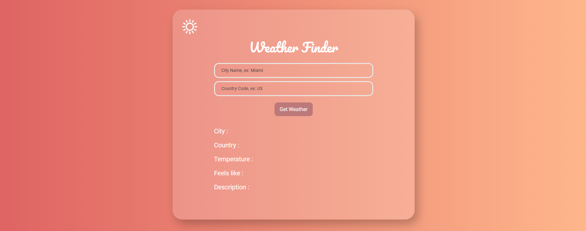

# Weather API in react

This app was created for a final project in DIG 4503, a Rapid Application class in my senior year at UCF. This project uses [React](https://reactjs.org/), and the [Open Weather Map API](https://openweathermap.org/api)

 

# How to use

To test the app, go to [Weather app live](https://stephenamaya.github.io/weather/). 
From there, you have two fields to submit the form, the first is the City name. The city name can be anything across the globe. The second form field is the country code, for anything in the United states use US. Follow the same structure internationaly, ex: Argentina: AR, Switzerland: CH.

# 

## License

Create React App is open source software [licensed as MIT](https://github.com/facebook/create-react-app/blob/master/LICENSE).
